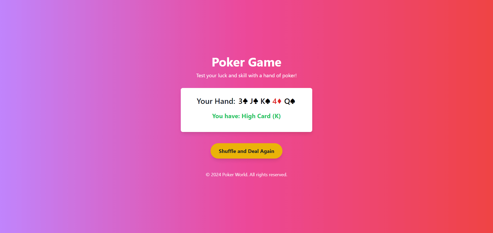
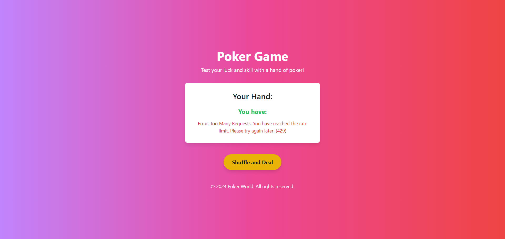
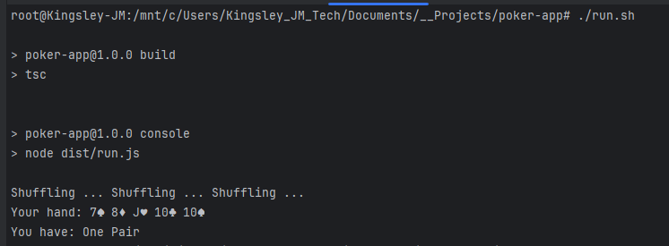
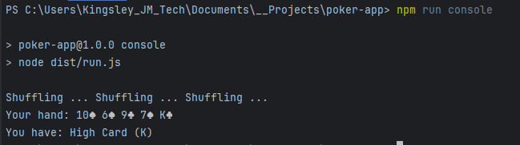
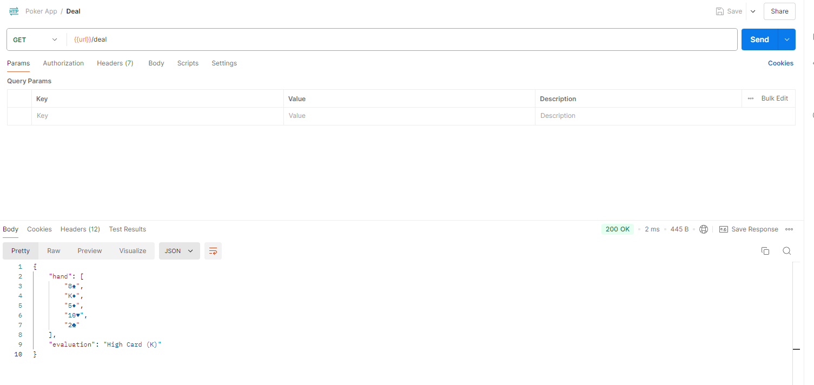
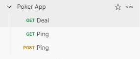

# Poker App

Test your luck and skill with a hand of poker!

## Endpoints For Backend

- **GET /api/v1/deal**: Responds with a random hand of 5 cards and evaluation.
- **GET /api/v1/ping**: Responds with "pong".
- **POST /api/v1/ping**: Responds with "pong from POST".

## Postman Collection Poker App.postman_collection.json in root dir

## Setup

Clone the repository:

   ```sh
   git clone https://github.com/kingsleyjmtech/poker-app.git
   ```

## Backend (Node.js)

1. Navigate to the project directory:
   ```sh
   cd poker-app
   ```

2. Install dependencies:
   ```sh
   npm install
   ```

3. Copy the example environment:
   ```sh
   cp .env.example .env
   ```

4. Update `.env` with your specific settings:
   Edit the `.env` file to include your actual configuration values.

5. Build the project:
   ```sh
   npm run build
   ```

6. To run tests:
   ```sh
   npm run test
   ```

7. Start the server:
   ```sh
   npm run start
   ```

8. The server should now be running at `http://localhost:3030`.

## Frontend (Vue.js) NB: Frontend is inside the client folder in the root dir of the project (Run in a separate terminal)

1. Navigate to the root directory of the project:

2. Navigate to the client folder:
   ```sh
   cd client
   ```

3. Install dependencies:
   ```sh
    npm install
    ```

4. Copy the example environment:
   ```sh
   cp .env.example .env
   ```

5. Update `.env` with your specific settings:
   Edit the `.env` file to include your actual configuration values.

6. Build the project:
   ```sh
    npm run build
    ```

7. Type Check, Lint and format the code (Optional):
   ```sh
    npm run type-check
    npm run lint
    npm run format   
    ```

8. Start the server:
    ```sh
     npm run preview
     ```

9. The server should now be running at `http://localhost:4173`.

## Screenshots of the App (Frontend and Backend)









